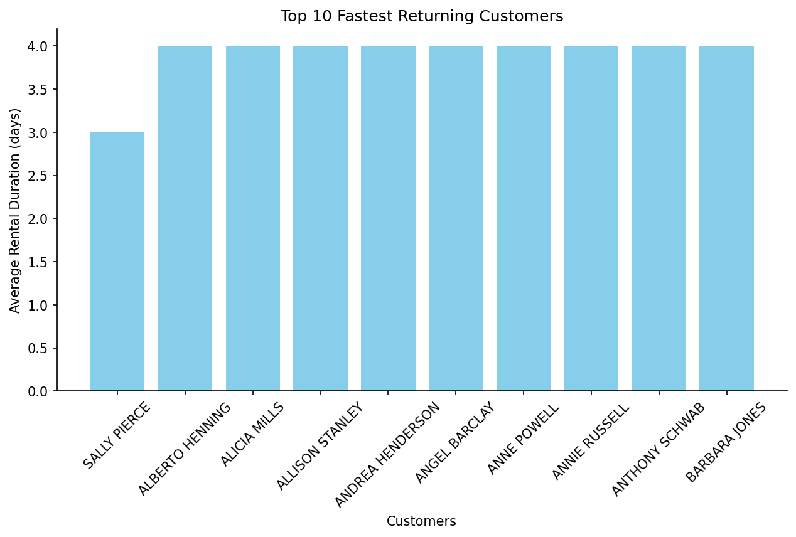

# sakila_lab_lilit_ajoyan

This project involves performing data analysis on the Sakila database using 
Python, DuckDB, pandas, and Evidence. The lab covers data ingestion,
exploratory data analysis (EDA), and building interactive dashboards to present insights from movie rental data.

---

# Purpose and Goals

The purpose of this lab is to explore and analyze the Sakila database using Python, DuckDB, and pandas. The main objectives are:
- Convert the existing SQLite Sakila database into DuckDB for efficient querying.
- Explore and analyze movie rental data to understand customer behavior, film categories, rentals, and revenue.
- Run SQL queries through DuckDB and analyze results in pandas.
- Build interactive visualizations and a dashboard with Evidence to summarize key findings.

---

## Highlights (will be updated as the lab progresses)
- Convert SQLite Sakila database into DuckDB
- Register database tables in pandas
- Run SQL queries and analyze results
- Create refined tables for analysis (e.g., customer_rental_duration)
- Build visualizations and saved charts as images

---

## Description of the Lab
This project focuses on:
- Data loading and database conversion  
- Querying and analyzing movie rental data  
- Understanding customer behavior, film categories, rentals, revenue, etc.  
- Creating a dashboard summarizing key findings  

*More details will be added during development.*

---

## Screenshots / Images
ERD of the Sakila database:

---

## Technologies Used
- Python (pandas, duckdb)
- Jupyter Notebook
- SQLite & DuckDB
- Evidence.dev
- Node.js + npm

---

## How to Run
- Place the database in your project folder
- Activate the virtual environment : uv init
- Install dependencies: uv add ipykernel "dlt[sql_database]" "dlt[parquet]" pandas matplotlib
- "load_sakila_sqlite_duckdb.py": Python script to load Sakila SQLite database into DuckDB using DLT
- uv add "dlt[duckdb]"
- Load the SQLite Sakila database into DuckDB: uv run python load_sakila_sqlite_duckdb.py
- Open sakila_lab_analysis.ipynb in Jupyter Notebook, connect to DuckDB, and register tables for analysis.
- Perform EDA in Jupyter Notebook, including custom questions such as customer rental durations
- Generate bar charts from refined tables and save as images for reporting or dashboard use

---

## Project Structure
sakila_lab_lilit_ajoyan/
│
├── .venv/ # Virtual environment
├── data/ # Database and images
│ ├── sqlite-sakila.db # Original SQLite Sakila database
│ ├── sakila.duckdb # DuckDB database (generated)
│ └── SQLite3 Sakila Sample Database ERD.png
│
├── load_sakila_sqlite_duckdb.py # Python script: load SQLite → DuckDB using DLT
├── sakila_lab_analysis.ipynb # Jupyter Notebook: EDA and SQL queries
├── README.md # Project overview, instructions, workflow
├── pyproject.toml # Python project configuration
├── uv.lock # Dependency lock file
├── .gitignore
└── .python-version # Python version file

## Workflow Overview
- Initialize project and set up the virtual environment.
- Convert SQLite Sakila database into DuckDB.
- Install required Python dependencies.
- Load and register database tables in pandas.
- Explore the database using SQL queries and pandas for analysis.
- Generate visualizations and build an interactive dashboard with Evidence.

## Refined Schema

Refined tables are created from the staging schema to provide clean, analysis-ready data.  
These tables are used for visualizations and dashboards.
